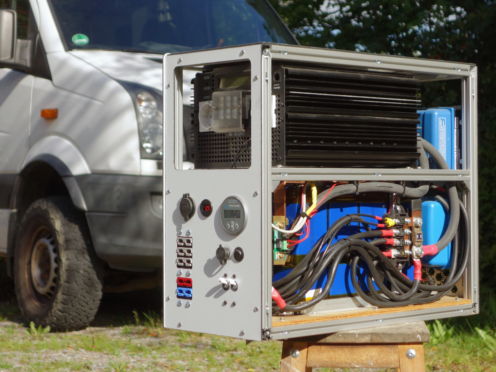
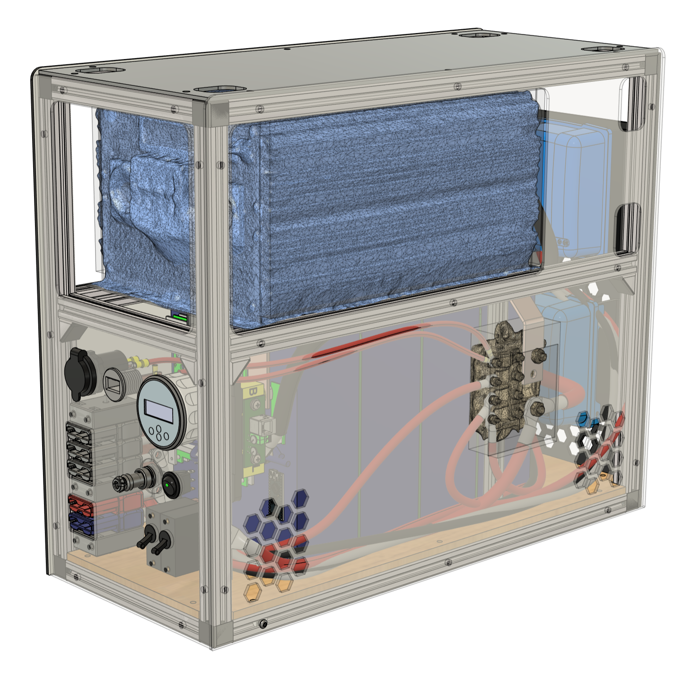
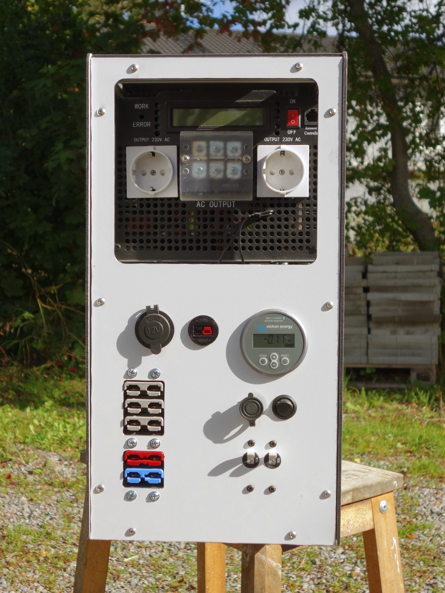
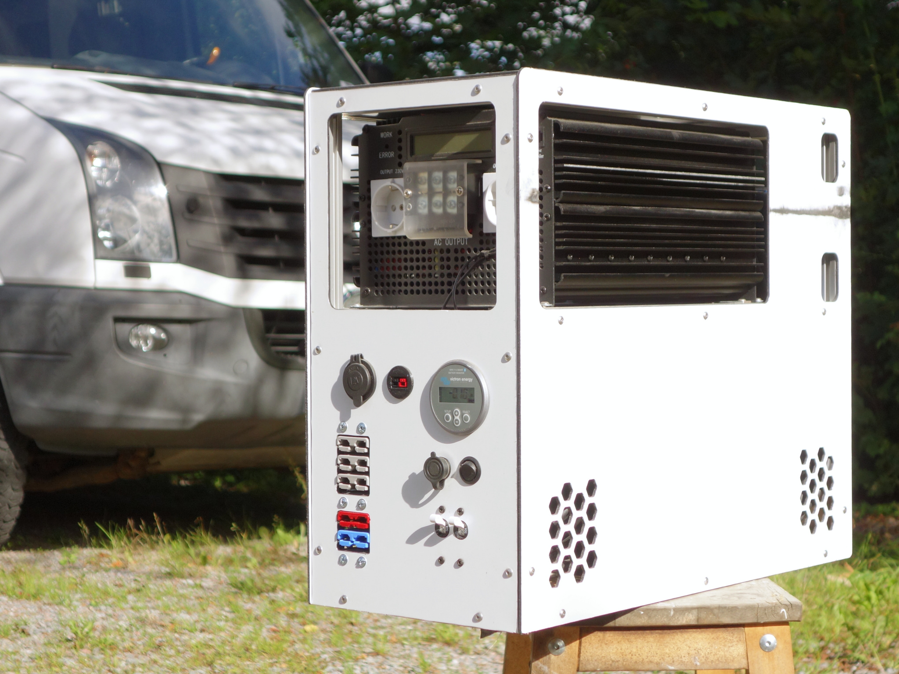

# ⚡ Portable Power Station

  
  
  
  

---

  

---

## TL;DR
A DIY 3kWh/3kW 12VDC native **portable power station** made for a camper van. It is power by four LiFePO4 280 Ah cells, have a BMS bypass with retained safety, modular design for on-the-road repairs.

> **Note**: Project is complete and **not under active development**. This repository conatians the digtial files form the time of design. I may or may not have made modifications along the way during build. This was a private oneoff build. **If you use any of this information for a similar build, you assume all risk.**

---

## :ledger: Highlights

- 12 VDC native. 
- Built in DCDC for charging from alternator
- Built in MPPT solar charger
- BMS bypass for high load with BMS protection retained (see more below)
- Built in lashing points and handles

---

## :ledger: About
This portable power station was made within a bigger project of converting a panel van to a camper van in 2021. I wanted to keep it everything modular so I didn't want to integrate the batteries etc. into the van.

At the time there were no portable power stations that could charge and discharge from/to 12 VDC in a satisfying way, so I made my own.

---

## :mag: Features

- **Electrical**:
  - **Inputs**:
    - 1× 30A alternator input (APP SBS 50)
    - 1× 100V/30A PV input (APP SBS 50)
  - **Outputs**:
    - 2× 230 VAC, 3kW
  - **Inputs/outputs**:
    - 3× 12 VDC, APP SBS 50
    - 1× 12 VDC, APP PowerPole
    - 1× 12 VDC, car lighter outlet
  - **Capacity**: ~3 kWh (4S1P LiFePO4)
  - **Safety**: Built in BMS and fuses.

- **Mechanical**:
  - **Dimensions**: L 550 x W 240 x H 450 mm
  - **Weight**: Around 65 kg (I haven't really put it on a scale)

- **UI**: 
  - Victron Energy BMV-712 (display on unit and via Victron Mobile BT App)
  - DCDC and Solar charger via Victron Mobile BT App.
  - BMS BT connectivity and App.

---

## :nut_and_bolt: Mechanical

**Design:**
- Internal aluminum extrusion frame
- Skins in Dibond alu-PE-alu panels
- Cell separators to avoid short from vibrations damageing the cell shrink wrap
- Frame and holes in panels form strong lashing points and handles

**Folder**: [`/mechanical`](mechanical/)
- **CAD**: Fusion 360 source (`.f3z`) + STEP exports

---

## :electric_plug: Electrical
**Genreal Design:**
- Modular design with mostly off-the-shelf parts.
- 4 pcs LiFePO4 280 Ah cells in in 4S1P configuration.
- Inverter did not have remote on/off so I modified with two cables soldered to the on/off switch

Why 12V?
  - most mobile products run on 12 VDC
  - for redundancy, you can easily get lead acid batteries on the road

**Folder**: [`/electrical`](electrical/)
- **Schematics**: Drawio source (`.drawio`) + PDF exports

---

## :floppy_disk: Firmware/Software
**BMS bypass:**

3 kW inverter means 250 A from 12 VDC source. 

At the time the JBD BMS was the shiznitz. The BMS, though, is only capable of 100 A.

To avoid bypassing the BMS completely an Arduino is acting as a man-in-the-middle on the UART between the BMS and the BT module. Fortunaltely the protocol is available online.

The Arduino polls a "discharge allowed" register while also relaying the other packages between the BT module and the BMS. If "discharge-allowed" is negative the Arduino breaks the inverter on/off circuit and the inverter shuts down.

I was very short on time at this point in the project so I turned to my brother, who is a software engineer, and he mangaged to crunch an arduino sketch in one day that have been working for a couple of years now! Thank you!

**Folder**: [`/firmware`](firmware/)
- **Firmware**: Arduino sketch (`.ino`)

---

## :camera: Gallery

  
  
   
  
    

---

## :scroll: Licensing
This work is licensed under the CC-BY 4.0 International License. To view a copy of this license, visit: https://creativecommons.org/licenses/by/4.0/

The CAD file contains contains models downloaded from and copyrighted by https://www.victronenergy.com/ and https://www.andersonpower.com/.